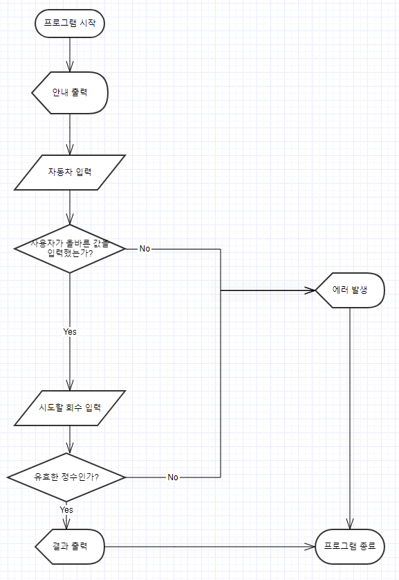

# 구현 기능 목록
## 목차
- [기능](#기능)
- [플로우 차트](#플로우-차트)
- [프로젝트 구조](#프로젝트-구조)
- [예외](#예외)
- [고려할 경우](#고려할-경우)
- [요구 사항](#요구-사항)
- [권장 사항](#권장-사항)
- [출력 예시](#출력-예시)
- [테스트 결과](#테스트-결과)
## 기능
- 경주 자동차 입력 기능
- 시도 횟수 입력 기능
- 무작위 값 생성 기능
- 전진 조건 판별 기능
- 전진 자동차 출력 기능
- 우승자 출력 기능
## 플로우 차트

## 프로젝트 구조
- src
    - main
        - java
            - racingcar
                - Application.java : 프로그램 실행 엔트리포인트
                - config
                    - Config.java : 게임 설정을 정의한 클래스
                - controller
                - domain
                - service
                - util
                - view
                    - InputView.java : input을 담당하는 뷰
                    - OutputView.java : output을 담당하는 뷰
    - test
        - java
            - baseball
                - ApplicationTest.java
## 예외
1. 자동차 이름을 입력할 때
   * 쉼표가 존재하지 않을 경우 (== 경주할 자동차가 하나일 경우)
   * 쉼표만 존재할 경우
   * 이름이 6자 이상일 경우
2. 시도할 회수를 입력할 때
   * 문자열을 입력한 경우
   * 음수, 0을 입력한 경우
   * 매우 큰 수를 입력한 경우
3. 자동차를 전진시킬 때
   * 무작위 값이 3이하일 경우
### 고려할 경우
1. 우승자가 없을 경우의 처리
2. 자동차 이름을 입력하고 쉼표를 찍었을때 띄어쓰기가 포함된 경우
3. 최대 참여 자동차 제한 여부
## 요구 사항
1. indent(인덴트, 들여쓰기) depth를 3이 넘지 않도록 구현한다. 2까지만 허용한다
2. 3항 연산자를 쓰지 않는다.
3. 함수(또는 메서드)가 한 가지 일만 하도록 최대한 작게 만들어라.
4. JUnit 5와 AssertJ를 이용하여 본인이 정리한 기능 목록이 정상 동작함을 테스트 코드로 확인한다
6. 삼항연산자를 사용하지 않는다.
7. JDK에서 제공하는 Random 및 Scanner API 대신 camp.nextstep.edu.missionutils에서 제공하는 Randoms 및 Console API를 사용하여 구현해야 한다.
### 권장 사항
1. else 예약어를 쓰지않는다.
2. 모든 원시값과 문자열을 포장한다.
3. 한 줄에 점 하나만 찍는다.
4. 클래스는 3개이상의 인스턴스 변수를 가지지않게한다
5. 일급컬렉션을 사용한다
## 출력 예시
```
경주할 자동차 이름을 입력하세요.(이름은 쉼표(,) 기준으로 구분)
pobi,woni,jun
시도할 회수는 몇회인가요?
5

실행 결과
pobi : -
woni : 
jun : -

pobi : --
woni : -
jun : --

pobi : ---
woni : --
jun : ---

pobi : ----
woni : ---
jun : ----

pobi : -----
woni : ----
jun : -----

최종 우승자 : pobi, jun
```
## 테스트 결과